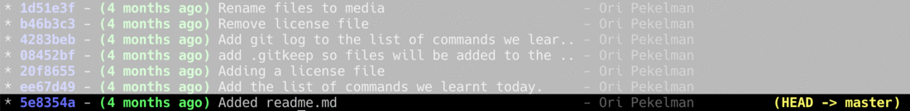

# Playing with our revisions

Now we have learned how to create versions of our code. Did you change a file? We type `git commit -am'Added some CSS styles for header'` Here is a new revision just created.

##View list of `git log` revisions

We can now type `git log` this very useful command lists all the changes in order.

```console
commit fbb1521c3eace22485aaf9394a2d875e992daf42 (HEAD -> master)
Author: Ori Pekelman <ori@platform.sh>
Date: Thu Oct 11 06:17:22 2018 +0100

    Add .gitkeep so files will be added to the repository

commit 59c8961247a28b50e73a29f9c686e9d21b64c25f
Author: Ori Pekelman <ori@platform.sh>
Date: Thu Oct 11 06:15:42 2018 +0100

    Adding a license file

commit b244fbb92edc16c7ac72dc4a19e3c67e0aff657e
Author: Ori Pekelman <ori@platform.sh>
Date: Thu Oct 11 06:10:30 2018 +0100

    Add the list of commands we learned today.

commit 5e8354a6e4215e11adc11cf3ca16c237f821dfad
Author: Ori Pekelman <ori@platform.sh>
Date: Thu Oct 11 06:06:51 2018 +0100

    Added readme.md
```

Here we have a nice list of everything that happened. And if we look closely there is nothing there that should surprise us... **commit** and its **sha** then the author and finally the date and our commit message. Only one thing got added there, in the first line **(HEAD -> master)**. We'll explain that a bit below. For now let's continue...

What if we modify `readme.md` to reflect what we just learned? you can open your favorite text editor and edit `readme.md`, I will still use the command line to add the line.

```console
echo "\n5. \`git log\` view all revisions" >> readme.md
```
And again we will add a small commit

```
git commit -am'added git log command'
```

Cool. It will continue to work. Now if I type `git log` again I will see at the top of the list my new commit:

```console
commit dc5139c9c77b0d2210301b3fdf68817311f57b2e (HEAD -> master)
Author: Ori Pekelman <ori@platform.sh>
Date: Thu Nov 29 15:22:26 2018 +0100

    added git log command
```

So now we've already done a lot of stuff in our little Git repository. We work on a single branch: **master**. Each time we added a **commit**, our **index** was updated. And **HEAD** this pointer to our work area was pointing to the most recent **commit**.



## Change Tracking

So we learned how to create a Git repository with `git init` then add files to it with `git add` and commit them with `git commit`.

We understood how to save successive changes: Each time I make a set of consistent changes.

> :example:
> For example if I'm working on the shopping cart of my e-commerce site, maybe I changed the template and adjusted the CSS which does a lot of work that makes sense... I'll do something like `git add views/shopping_cart.html public/styles/shoping_cart.css` then `git commit -m'Add pretty red button to shopping cart ticket #654'`.

Later I might even go back in time and see the state of things before I made this change.

But how do you see what has changed?

## git diff` to see what changed

So back to our repository to remember our last change was to add a line to `readme.md`. The `:information_source:` command gives us the list of changes, doesn't it? The penultimate commit is **817c439** and we can now see what has changed.

The command:

```console
git diff 817c439
```
Will tell us something like:
```
diff --git a/readme.md b/readme.md
index 3fbc902..c51e8c4 100644
--- a/readme.md
+++ b/readme.md
@@ -7.3 +7.5 @@ Today we learned the following Git commands:
 3. `git add` - add files to the git index to prepare for a commit
 4. `git commit -m"{commit message}"` - save a milestone in the git repository

+
+5. `:information_source:` see all revisions
```

Basically it gives us the result of the `diff` command to calculate the difference between two files. Here we can see that we have added a line break and then a line of text.

> :information_source:
> Git unlike other version control systems does not keep a chain of changes... but real snapshots of each file. When we see the "diff" the difference between two states of a file it calculates that on the fly. But as we noted above.. Git knows how to be very smart and pack things well, with **git-pack** being a super-smart and awfully optimal format -- by the way, it's one of reasons why Git is so fast. But this is an internal implementation detail that has no effect on your use of the tool and therefore outside the scope of this course: we go as deep as necessary to understand what we are doing. , precisely. But not more.

## git diff --cached` to see what was added to the index

Once we have added things to the index, to our **staging**, `git diff` won't tell us anything. If you want to see changes that are ready to **commit**... `git diff --cached` is our friend.


## The differences with the last commit...

We've seen how to use `git diff` with the **SHA** of a revision, but Git also provides us with a nice syntax for talking in relative times. For example `git diff HEAD~1` is a way of saying: give me the **diff** with the previous commit. `git diff HEAD~2`, you would have understood it shows us the difference with the penultimate commit.

## How do I know when a change has been introduced? `git blame`

Quite often when we read code we are not sure we understand everything. We see a line. And you wonder.. but why, why oh gods, did I do this? Git remembering everything can help us.

If `git diff` tells us the difference between two commits, and `git log` gives us the list of all the commits... `git blame` can tell us for a file at a specific **commit**, when and why each line has been added or modified.

```console
git blame README.md
```

```console
^5e8354a (Ori Pekelman 2018-10-11 06:06:51 +0100 1) # My first Git project
ee67d49b (Ori Pekelman 2018-10-11 06:10:30 +0100 2)
ee67d49b (Ori Pekelman 2018-10-11 06:10:30 +0100 3) Today we learned the following Git commands:
ee67d49b (Ori Pekelman 2018-10-11 06:10:30 +0100 4)
ee67d49b (Ori Pekelman 2018-10-11 06:10:30 +0100 5) 1. `git init` - initialize a new git repository
ee67d49b (Ori Pekelman 2018-10-11 06:10:30 +0100 6) 2. `git status` - get status of working directory relative to git repository
ee67d49b (Ori Pekelman 2018-10-11 06:10:30 +0100 7) 3. `git add` - add files to the git index to prepare for a commit
ee67d49b (Ori Pekelman 2018-10-11 06:10:30 +0100 8) 4. `git commit -m"{commit message}"` - save a milestone in the git repository
ee67d49b (Ori Pekelman 2018-10-11 06:10:30 +0100 9)
4283beb2 (Ori Pekelman 2018-10-11 06:15:30 +0100 10)
4283beb2 (Ori Pekelman 2018-10-11 06:15:30 +0100 11) 5. `git log` view all revisions
```

Here we can see that the very first line was added in the initial commit (marked with `^`). Then we have two more commits. We can thus go back in time... and understand precisely the why and the how.

## git show` to see the contents of the commit

We can now watch a particular commit with the `git show` command and see when the change was introduced.

```console
git show ee67d49b
```

```console
commit 4283beb2eadab3479f65fd2dd64f3afc73f26aa6
Author: Ori Pekelman <ori@platform.sh>
Date: Thu Oct 11 06:15:30 2018 +0100

    Add git log to the list of commands we learned today.

diff --git a/readme.md b/readme.md
index 3fbc902..c51e8c4 100644
--- a/readme.md
+++ b/readme.md
@@ -7.3 +7.5 @@ Today we learned the following Git commands:
 3. `git add` - add files to the git index to prepare for a commit
 4. `git commit -m"{commit message}"` - save a milestone in the git repository

+
+5. `git log` see all revisions
```

> :information_source: the `git show` command is very useful, it can show us only the content of a **commit** but also of a **tree** or a **blob**

If you use the command with no arguments it will show you the very last commit. The one at the tip of your **master** branch. But without even doing `git log` Git gives us very useful shortcuts to talk about a commit without knowing its **SHA**.

 * `git show HEAD^` - the little hat allows us to reference the parent of note commit. So the previous commit.
 * `git show HEAD^^^` - we can add multiple. Here we will see the great-grandparent of our commit;
 * `git show HEAD~10` - but if we don't want to have ten little hats... the tilde `~` does the same thing but followed by a number. Here we will see what happened ten commits ago.

Let's imagine that we have taken a wrong turn. Or that we just want to know what happened in one of our commits. As we have already seen the `git log` command allows us to see the list of changes. Who did what when and why. And `git checkout` allows us to go and take a past commit and set our work area to the state of that commit.

##Getting to a past state with `git checkout`

Now imagine that we want to go back in time before we made this change.

Nothing could be simpler: in the log I will look at the **SHA** the hash of the previous commit and I can now type:

```console
git checkout fbb1521
```

His response is going to be a bit wordy, so let's ignore it for now and just look at the first and last line:

```console
Note: checking out '817c439450d04ccabb7a09bebfd3d1d058f0bcf5'.
    # [blah blah blah blah Git tries to be super helpful]
HEAD is now at 817c439 Add .gitkeep so files will be added to the repository
```

We have returned to the past. If we type `cat readme.md` we will see our file as it was before adding note point 5.

And we can type `git log` again to see.

**Sapristi**! Indeed we are in the previous state and our last commit has completely disappeared. Is it a good time to panic? No. You should never panic.

The command:

```console
git log --branches
```

> :information_source:
> Git is a big beast: for each command there are sometimes dozens of different options. We will, of course, only see the main things.

So `git log --branches` will show us that we haven't lost anything. And in addition we will see some additional interesting information.

```console
commit dc5139c9c77b0d2210301b3fdf68817311f57b2e (master)
Author: Ori Pekelman <ori@platform.sh>
Date: Thu Nov 29 15:22:26 2018 +0100

    added git log command

commit 817c439450d04ccabb7a09bebfd3d1d058f0bcf5 (HEAD)
Author: Ori Pekelman <ori@platform.sh>
Date: Thu Oct 11 06:17:22 2018 +0100

    Add .gitkeep so files will be added to the repository

commit ee169bcc1fc59fd3c24ae144da013d1f8f289498
Author: Ori Pekelman <ori@platform.sh>
Date: Thu Oct 11 06:15:42 2018 +0100

    Adding a license file

commit 625ef35b031a9ea861e19a95dfba879e9a52a1ed
Author: Ori Pekelman <ori@platform.sh>
Date: Thu Oct 11 06:10:30 2018 +0100

    Add the list of commands we learned today.

commit 5e8354a6e4215e11adc11cf3ca16c237f821dfad
Author: Ori Pekelman <ori@platform.sh>
Date: Thu Oct 11 06:06:51 2018 +0100

    Added readme.md
```
Indeed `git log` by default shows us the past of the point in which we are. Nothing has been lost. Here is the **log** which is the same thing.. except for one small thing: where at the top we had **(HEAD -> master)**, now **dc5139** is marked as **master** and **817c43** as **HEAD**. What is it about ?

**HEAD** is a pointer to where we are now. We were on commit **dc5139c** and now our work area is, in the past on **817c43**.

If we now do `git checkout master` the **HEAD** pointer will once again position itself on our very last commit, the one with the message "added git log command". We can check it with `git log` or `git log --branches` (which there, therefore, will do precisely the same thing).

But it's weird, we learned to do `git checkout {sha}` and now instead of putting lots of weird characters we write in full **master**.

So what is **master**? **master** is a branch. As we already told you in the introduction, with Git we can work not only on revisions as a single time arrow... but on multiple different versions, at the same time. **master** or _maître_ in French is as its name suggests: the master version, the top of the tree. A bit later we'll show you how to create more branches, how to use `git checkout` to jump from one to another, for now let's stick with one trunk.

> :information_source:
> In other version management systems, such as the venerable CVS or SVN, this master branch was indeed called "Trunk" or in French "tronc" which gives the image of this main branch of which all the others come out. For Git, it's a simplification, it's so powerful and malleable that this concept is reductive ... but here we go, we're not going to complicate our lives too much right now. So imagine **master** as the main trunk.

As with **HEAD** a branch is simply a pointer to a **commit**. And often the **HEAD** points to the top of the branch we are on. As we are on the **master** branch, **HEAD** points to the "top" of it. Our latest commit.

We like to look under the hoods don't we? let's look at a few other data structures inside our dear `.git` to be sure we understand.

Make sure you have done `git checkout master` and we can try the following commands

```console
cat .git/HEAD
```
Who will take us out:

```console
ref: refs/heads/master
```
So this is a reference, pointing to `refs/heads/master` -- that stuff is also a file under `.git`. We can follow the trace and type:

```console
cat .git/refs/heads/master
```

And it will respond to us with the **SHA**, the **commit-id** of our very last commit:

```console
dc5139c9c77b0d2210301b3fdf68817311f57b2e
```

Earlier when we did `git checkout 817c439`, git gave a big message that we chose to ignore, let's read it now:

```console
Note: checking out '817c439'.

You are in 'detached HEAD' state. You can look around, make experimental
changes and commit them, and you can discard any commits you make in this
state without impacting any branches by performing another checkout.

If you want to create a new branch to retain commits you create, you may
do so (now or later) by using -b with the checkout command again. Example:

  git checkout -b <new-branch-name>

HEAD is now at 817c439 Add .gitkeep so files will be added to the repository
```

That's what he's telling us: hey, you've chosen to do a `checkout` not on the top of the branch, but on a specific **commit**. **HEAD**, the head, the pointer of the current state is now "detached" from its branch (remember in English "Detached head").

> :information_source: we can do `git checkout {the-name-of-a-branch}` because the branch is just a pointer to a **commit** so `git checkout master` takes us back to the top of our tree , at our last **commit**


## Did we really go wrong? Start clean with `git reset`

We were able to go back already in the past with `git checkout` which put our work area in the state of a previous commit. But then we were in this kind of weird state. The **detached head**, or HEAD, was no longer pointing to the top of our branch. If we wanted to we could go back in time so that we could go on again.

Let's imagine for example that all this dithering around the name of our `media` directory is messing up our history, that it brings no value to the future reader of our code. Or the fact that we added the LICENSE file just to remove it later?

Our current history is:
```console
* e3e73b4 - (4 months ago) Rename files to media - Ori Pekelman (HEAD -> master)
* 9f49d65 - (4 months ago) Remove license file - Ori Pekelman
* 9911ff4 - (4 months ago) Add git log to the list of commands we learn.. - Ori Pekelman
* f645e6b - (4 months ago) Add .gitkeep so files will be added to the .. - Ori Pekelman
* 6dcbff3 - (4 months ago) Adding a license file - Ori Pekelman
* 2940f38 - (4 months ago) Add the list of commands we learned today. - Ori Pekelman
* 5e8354a - (4 months ago) Added readme.md - Ori Pekelman
```

`git reset 2940f38` will reset **HEAD** to this commit, like our `git checkout`. But our work area remains in its current state, a `git status` will tell us:
```console
On branch master
Changes not staged for commit:
  (use "git add <file>..." to update what will be committed)
  (use "git checkout -- <file>..." to discard changes in working directory)

modified: readme.md

Untracked files:
  (use "git add <file>..." to include in what will be committed)

media/

no changes added to commit (use "git add" and/or "git commit -a")```

We can now create new **commit**s, clean:

```console
git add readme.md
git commit -m'Add git log to the list of commands we learned'
git addmedia
git commit -m'Add media directory with .gitkeep'
```

Now our history is much cleaner:

```console
* 2f13f45 - (4 months ago) Add media directory with .gitkeep - Ori Pekelman (HEAD -> master)
* 0809db1 - (4 months ago) Add git log to the list of commands we learn.. - Ori Pekelman
* bbde8c5 - (4 months ago) Add the list of commands we learned today. - Ori Pekelman
* 5e8354a - (4 months ago) Added readme.md - Ori Pekelman
```

In this case we wanted to roll back to a previous state while keeping the changes we made. But what if we really want to get rid of our last few commits? we can do a hard reset with `git reset --hard`.

Thus `git reset --hard 5e8354a` will bring us back to our initial state, with a single `readme.md` file which will have a single line of content. Sometimes it's nice to get rid of the weight of the past.

> :warning: We'll see it below that we're going to talk about collaboration, but let's note something right away; When we work alone, on a repository of our own, on a branch of our own, rewriting the past is pleasant and useful. But when we start working with others we won't have the same luxury. The past is the past. We have other Git commands that allow us to undo things keeping a common history like `git revert` which we will see later.

## Summary view and play with history

* `git log` allows us to see the list of **commit**s in the past, the list of revisions
* `git diff` allows us to see the changes introduced in a **commit**
* `git blame` allows us to inspect a file and see which line was modified by which **commit**
* `git show` allows us to inspect a **commit**, but also a **tree** or a **blob**
* **master** is a branch of our code, even the master branch
* **detached head** this is the situation where our **HEAD** pointer is not pointing to the last commit of a branch.
* `git checkout {commit}` allows us to pass the current work area **commit* pointer to a specific **commit** it changes the **HEAD** pointer and it resets our work area to the state it had at the time of this commit.
* `git reset {commit}` does the same thing as `git checkout` but also resets the top of our **branch** to this commit keeping the changes in our work area.
* `git reset --hard {commit}` does the same by removing all our changes from the scratchpad